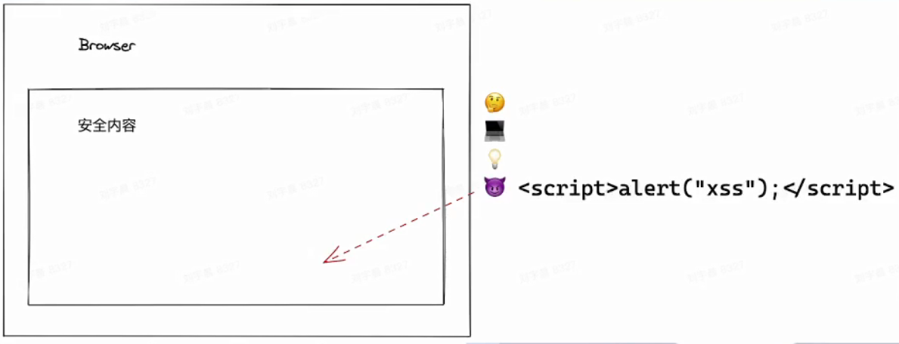
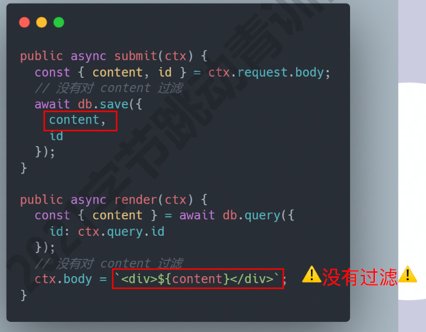
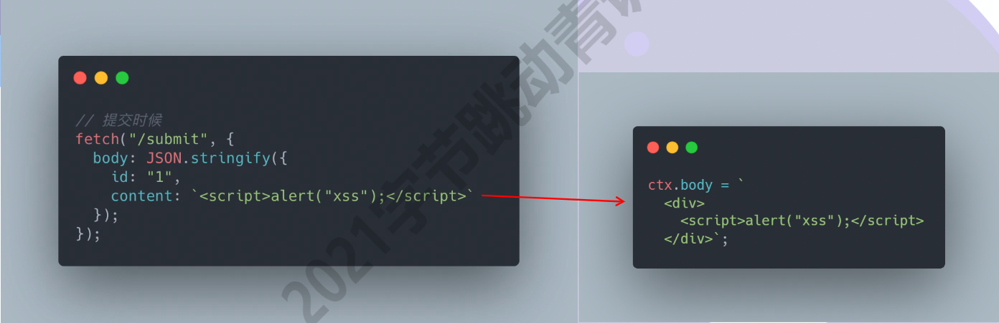
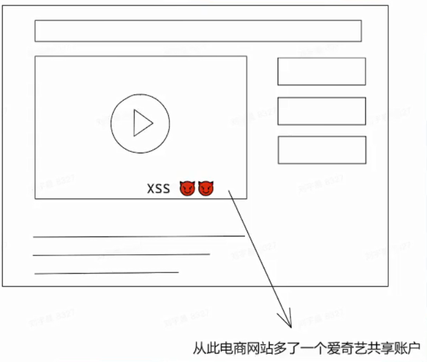
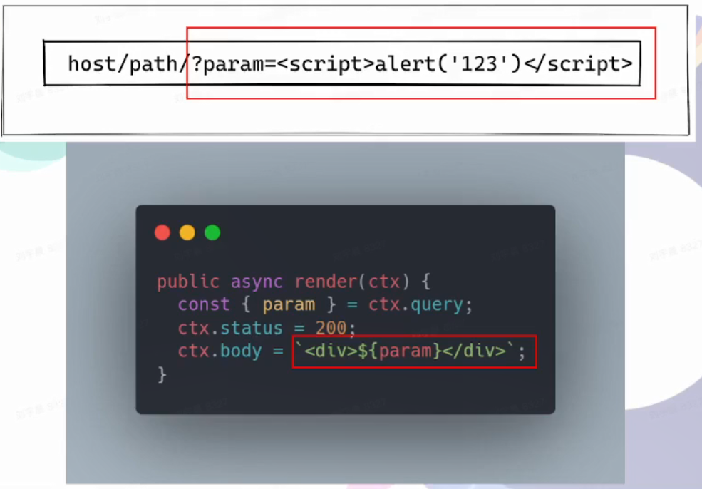

# web开发安全

## 攻击篇 

###  Cross-Site Scripting 跨站脚本攻击（XSS）

XSS就是 攻击者往页面中插入 **攻击脚本** ，对页面进行攻击

攻击者使用XSS，主要是利用了

>开发者盲目信任用户提交的内容（比如带有恶意的字符串）    
>开发者直接把字符串生成DOM

这些恶意的代码可能是
- `document.write`
- `element.innerHTML = anyString`
- `SSR(user_data)` // 伪码

XSS的一些特点

- 通常难以从UI上感知（暗地执行脚本）
- 窃取用户的敏感信息（cookie/token）
- 绘制UI（比如弹窗），诱骗用户点击/填写表单

#### 看一个demo

这里有两个服务端的接口：

`submit`会接收请求，把请求中的参数存入数据库中

`render`会从数据库中读取内容，然后返回给HTML

注意：两次接口都没有对用户提交的内容做任何过滤

如果我们是攻击者，可以这样进行攻击：数据使用一个script标签包裹，然后在里面写一些恶意脚本提交给服务器，之后服务器就会返回到页面，脚本就会被执行

 
## XSS攻击类型
### Stored XSS(存储型)

- 恶意脚本被存在数据库中
- 访问页面 -> 读数据 === 被攻击
- 危害最大，对全部用户可见

> 上述demo就是一个存储性XSS

### Reflected XSS(反射型)

- 不涉及数据库
- 从`URL`上攻击
  

在URL参数上加入恶意脚本，服务端解析参数直接读取，渲染成HTML，不经过任何过滤这样也达成一次XSS攻击
